<!-- profile: evaltrust audit terminal -->
<div align="center">



<br>

# Kyle Dickinson
**Mathematics @ Carnegie Mellon University · Class of 2029**

<br>

`▸ curr`&nbsp;&nbsp;**Software Engineer Intern** at **Starburst AI Labs (SAIL)**

<sub>Building a model that predicts which words in a question matter most for generating the correct SQL query —<br>a joint tagging + relation-extraction architecture (BiLSTM · CRF).</sub>

</div>

---

### `Test Results`

> Each result below is backed by real evidence, not vibes. Null hypothesis: *"just another student."*

| project | verdict | one-line summary |
|:--|:--:|:--|
| [**EvalTrust**](https://github.com/k-dickinson/evaltrust) &nbsp;`flagship` | `significant` | Significance testing for AI evals — knows if a model *really* improved or just got lucky |
| [**Pokerank**](https://pokerank.net) | `passed` | Real-time platform serving **700+ users** (Docker · Redis · Postgres) |
| [**Pacman-RL**](https://github.com/k-dickinson/ai_pacman) | `passed` | Q-learning agent hitting **92% survival** on a Markov Decision Process |
| [**Crypto Microstructure**](https://papers.ssrn.com/sol3/papers.cfm?abstract_id=6057134) | `published` | Order flow explains **47.1%** of BTC price variance — published on SSRN |

---

### `Confidence Intervals`

```text
ML / NLP / evals   ███████████████████░   Transformers · LLMs · BiLSTM-CRF · RL · significance testing
Python & stack     ██████████████████░░   Python · PyTorch · Hugging Face · SciPy · statsmodels · NumPy
Infra & MLOps      ████████████████░░░░   AWS (SageMaker · S3) · Docker · Redis · PostgreSQL · GitHub Actions
Math foundation    ███████████████████░   Probability Theory · Statistics · Linear Algebra · Discrete Math
```

---

### `Additional Significant Findings`

- **Jane Street Market Making @ CMU** — placed **2nd / 200+**, capturing price dislocations under high volatility
- **Goldman Sachs × CMU Quantathon** — semi-finalist (HMM Bayesian filtering & parameter estimation)
- **CMU Quant Club** — VP of Marketing

---

<div align="center">

### `Reproducibility`

Reach me at **kdickins@andrew.cmu.edu** &nbsp;·&nbsp; results independently verifiable in the linked repos.

<sub><code>H0 rejected. Thanks for reviewing the evidence.</code></sub>

</div>
